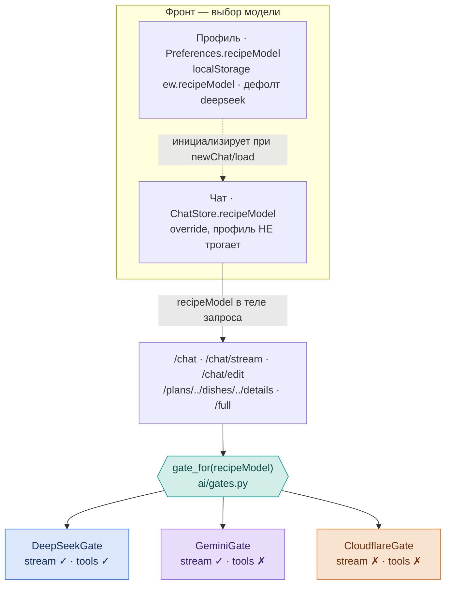
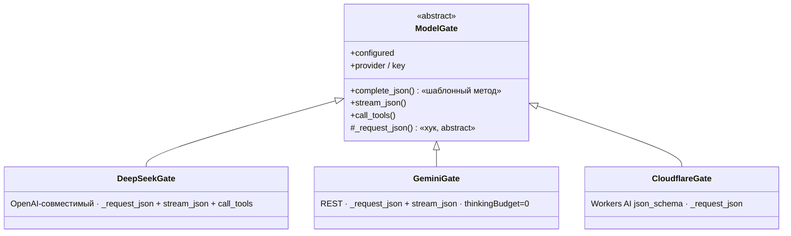
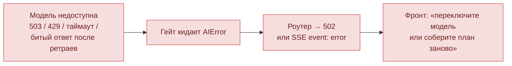
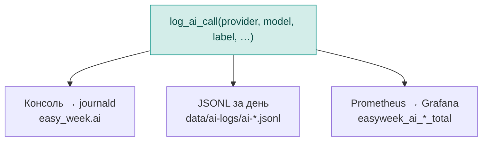

# Архитектура: выбор и роутинг AI-моделей

Как в Easy Week работает выбор модели для рецептов. Правила — в [`CLAUDE.md`](../CLAUDE.md),
код — в `backend/app/ai/`. Наглядная интерактивная версия этой схемы — артефакт (ссылку см. в задаче).

**Главное:** три провайдера спрятаны за общим интерфейсом `ModelGate`. Пользователь выбирает
модель для рецептов; выбранная модель либо отвечает, либо честно падает с `AIError` — **тихого
перехода на другую модель нет (фолбэков нет)**.

Провайдеры (цвет = провайдер на схемах):
- 🔵 **DeepSeek** — `deepseek-chat`
- 🟣 **Gemini** — `gemini-flash-latest`
- 🟠 **Cloudflare** — Workers AI (mistral / llama)

## 1. Выбор модели и роутинг

Два независимых уровня выбора на фронте; переключение в чате **не** меняет дефолт профиля.
`recipeModel` едет в теле каждого запроса (как `gender`), на бэке `gate_for()` отдаёт нужный гейт.



## 2. Классы: `ModelGate` (Strategy + Template Method)

Общий пайплайн — в базе (`ai/base.py`), провайдер-специфика — в хуках подклассов.
Шаблонный метод `complete_json`: guard «настроен?» → ретрай транзиентных ошибок →
`log_ai_call` → `(parsed, usage)`. `stream_json`/`call_tools` — переопределяемые
(по умолчанию `NotImplementedError`).



## 3. Что делает каждая модель по задачам

Выбранная модель обслуживает все рецептные задачи. Список покупок — исключение (всегда Cloudflare).

| Задача | 🔵 DeepSeek | 🟣 Gemini | 🟠 Cloudflare |
|---|---|---|---|
| **План** (блюда + короткие шаги) | один запрос — весь план | один запрос — весь план | **пайплайн:** меню (mistral) → спеки блюд (llama-8b, параллельно) → валидатор (mistral) |
| **Стриминг плана** | блюда по мере генерации (SSE) | блюда по мере генерации (SSE) | стрима нет: собирает целиком, отдаёт блюда теми же событиями |
| **Деталь рецепта** (ингредиенты + шаги) | один JSON-запрос текущей моделью чата — одинаково для всех трёх | ← | ← |
| **Правки плана** | function calling (tools) | structured actions | structured actions |
| **Список покупок** | всегда Cloudflare (mistral) — вспомогательная задача, в выборе не участвует | ← | ← |

Метка провайдера сохраняется у плана (`provider`) и у детали блюда (`detail_provider`) — показывается бейджем.

## 4. Если модель падает — ошибка, а не подмена

Главное следствие отказа от фолбэков: сбой виден, решает его пользователь.



## 5. Наблюдаемость: один лог — три стока

Каждый успешный вызов проходит через `log_ai_call` (внутри `complete_json`/стрима — логируется сам).



## Файлы

```
backend/app/ai/
  base.py        # AIError + ModelGate (шаблонный метод + хуки)
  gates.py       # реестр GATES + gate_for(model)
  deepseek.py    # DeepSeekGate
  gemini.py      # GeminiGate
  cloudflare.py  # CloudflareGate
  planner.py     # роутинг по выбранной модели, без фолбэков
  observe.py     # log_ai_call (консоль + JSONL + Prometheus)
```
