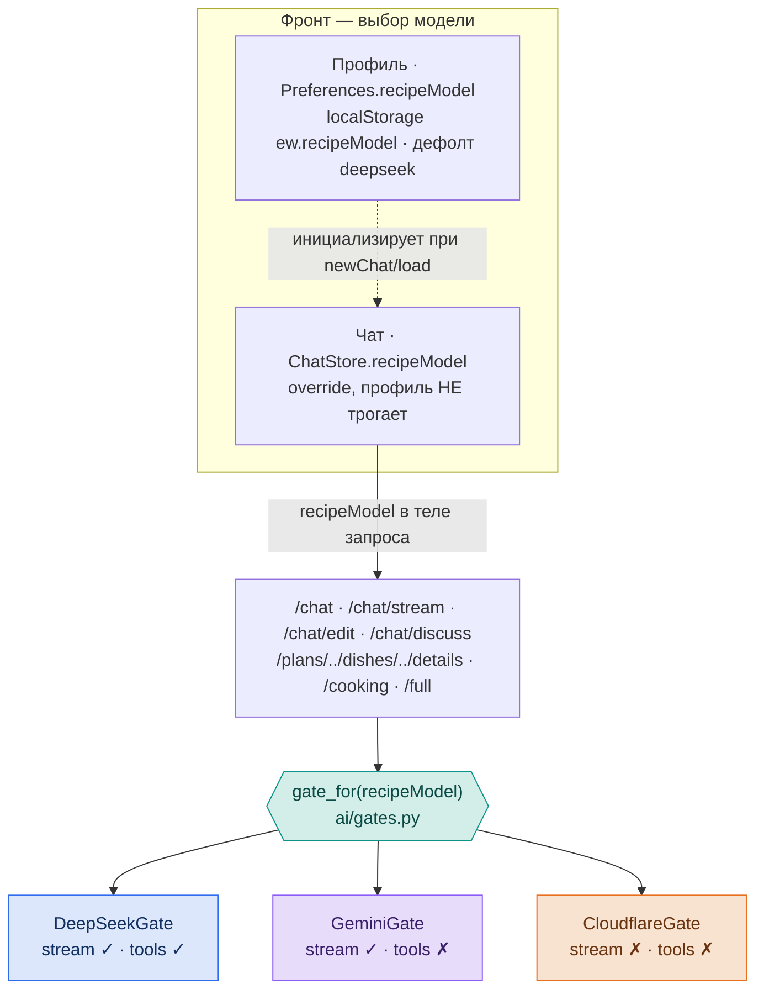
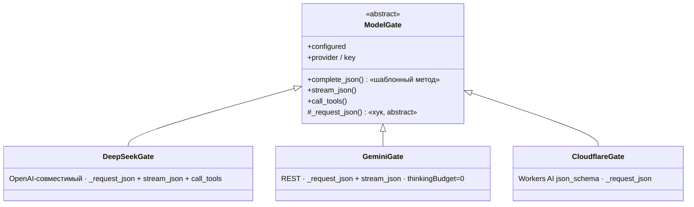
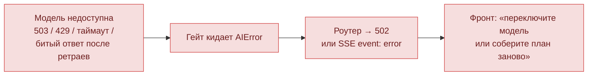
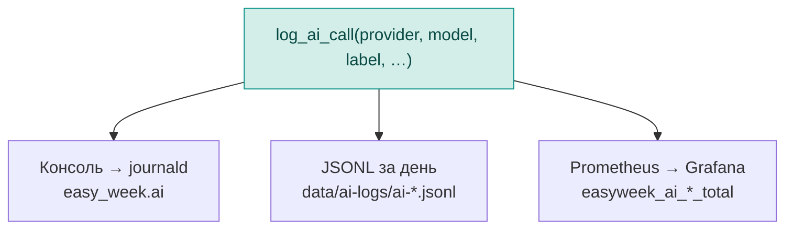

# Архитектура: выбор и роутинг AI-моделей

Как в Easy Week работает выбор модели для рецептов. Правила — в [`CLAUDE.md`](../CLAUDE.md),
код — в `backend/app/ai/`. Наглядная интерактивная версия этой схемы — артефакт (ссылку см. в задаче).

**Главное:** три провайдера спрятаны за общим интерфейсом `ModelGate`. Пользователь выбирает
модель для рецептов; выбранная модель либо отвечает, либо честно падает с `AIError` — **тихого
перехода на другую модель нет (фолбэков нет)**.

Провайдеры (цвет = провайдер на схемах):
- 🔵 **DeepSeek** — `deepseek-chat`
- 🟣 **Gemini** — `gemini-flash-latest`
- 🟠 **Cloudflare** — Workers AI (mistral / llama)

## 1. Выбор модели и роутинг

Два независимых уровня выбора на фронте; переключение в чате **не** меняет дефолт профиля.
`recipeModel` едет в теле каждого запроса (как `gender`), на бэке `gate_for()` отдаёт нужный гейт.


```mermaid
flowchart TD
  subgraph FE["Фронт — выбор модели"]
    P["Профиль · Preferences.recipeModel<br/>localStorage ew.recipeModel · дефолт deepseek"]
    C["Чат · ChatStore.recipeModel<br/>override, профиль НЕ трогает"]
    P -. "инициализирует при newChat/load" .-> C
  end
  C -- "recipeModel в теле запроса" --> API["/chat · /chat/stream · /chat/edit · /chat/discuss<br/>/plans/../dishes/../details · /cooking · /full"]
  API --> GF{{"gate_for(recipeModel)<br/>ai/gates.py"}}
  GF --> DS["DeepSeekGate<br/>stream ✓ · tools ✓"]
  GF --> GM["GeminiGate<br/>stream ✓ · tools ✗"]
  GF --> CF["CloudflareGate<br/>stream ✗ · tools ✗"]

  classDef ds fill:#dde7fc,stroke:#2f6bed,color:#12305f;
  classDef gm fill:#e7ddfb,stroke:#8b5cf6,color:#3a1f6b;
  classDef cf fill:#f8e3d1,stroke:#e8701d,color:#6b3410;
  classDef sys fill:#d3ede9,stroke:#0d9488,color:#0a4a44;
  class DS ds; class GM gm; class CF cf; class GF sys;
```

## 2. Классы: `ModelGate` (Strategy + Template Method)

Общий пайплайн — в базе (`ai/base.py`), провайдер-специфика — в хуках подклассов.
Шаблонный метод `complete_json`: guard «настроен?» → ретрай транзиентных ошибок →
`log_ai_call` → `(parsed, usage)`. `stream_json`/`call_tools` — переопределяемые
(по умолчанию `NotImplementedError`).


```mermaid
classDiagram
  class ModelGate {
    <<abstract>>
    +complete_json()  «шаблонный метод»
    +stream_json()
    +call_tools()
    #_request_json()  «хук, abstract»
    +configured
    +provider / key
  }
  ModelGate <|-- DeepSeekGate
  ModelGate <|-- GeminiGate
  ModelGate <|-- CloudflareGate
  class DeepSeekGate { OpenAI-совместимый · _request_json + stream_json + call_tools }
  class GeminiGate { REST · _request_json + stream_json · thinkingBudget=0 }
  class CloudflareGate { Workers AI json_schema · _request_json }
```

## 3. Что делает каждая модель по задачам

Выбранная модель обслуживает все рецептные задачи. Список покупок — исключение (всегда Cloudflare).

| Задача | 🔵 DeepSeek | 🟣 Gemini | 🟠 Cloudflare |
|---|---|---|---|
| **План** (блюда + короткие шаги) | один запрос — весь план | один запрос — весь план | **пайплайн:** меню (mistral) → спеки блюд (llama-8b, параллельно) → валидатор (mistral) |
| **Стриминг плана** | блюда по мере генерации (SSE) | блюда по мере генерации (SSE) | стрима нет: собирает целиком, отдаёт блюда теми же событиями |
| **Деталь рецепта** (ингредиенты + шаги) | один JSON-запрос текущей моделью чата — одинаково для всех трёх | ← | ← |
| **Правки плана** | function calling (tools) | structured actions | structured actions |
| **Список покупок** | всегда Cloudflare (mistral) — вспомогательная задача, в выборе не участвует | ← | ← |
| **Обсуждение** (`/chat/discuss`: рецепт / готовка / покупки) | function calling (`DISCUSS_TOOLS`: update_recipe · replace_dish · regenerate) | structured JSON (`DISCUSS_SCHEMA`) | structured JSON (json_schema) |
| **↻ Перегенерировать** (рецепт / план готовки) | выбранная (открытая) модель, всегда новый вариант с учётом обсуждения | ← | ← |
| **↻ Перегенерировать** (покупки) | нормализация Cloudflare мимо кэша, с учётом обсуждения | ← | ← |

Метка провайдера сохраняется у плана (`provider`) и у детали блюда (`detail_provider`) — показывается бейджем.

## 4. Если модель падает — ошибка, а не подмена

Главное следствие отказа от фолбэков: сбой виден, решает его пользователь.


```mermaid
flowchart LR
  F["Модель недоступна<br/>503 / 429 / таймаут /<br/>битый ответ после ретраев"] --> E["Гейт кидает AIError"]
  E --> R["Роутер → 502<br/>или SSE event: error"]
  R --> U["Фронт: «переключите модель<br/>или соберите план заново»"]
  classDef err fill:#f6dede,stroke:#d24545,color:#6e1f1f;
  class F,E,R,U err;
```

## 5. Наблюдаемость: один лог — три стока

Каждый успешный вызов проходит через `log_ai_call` (внутри `complete_json`/стрима — логируется сам).


```mermaid
flowchart TD
  L["log_ai_call(provider, model, label, …)"] --> A["Консоль → journald<br/>easy_week.ai"]
  L --> B["JSONL за день<br/>data/ai-logs/ai-*.jsonl"]
  L --> C2["Prometheus → Grafana<br/>easyweek_ai_*_total"]
  classDef sys fill:#d3ede9,stroke:#0d9488,color:#0a4a44;
  class L sys;
```

## 6. Контекст промптов и разнообразие

System-промпты стабильны (общий префикс `COOK_PREAMBLE + FREEZE_RULES` кэшируется DeepSeek);
всё динамическое — в USER-сообщении.

- **Новый план** (`/chat`, `/chat/stream`, CF-пайплайн): запрос + подсказка числа блюд + неделя/сезон
  (`_date_hint`) + «Недавно ели или отвергли — не повторяй и не делай близких вариаций» (≤30 названий,
  `services/history.variety_avoid`: 4 последних принятых плана, заменённые/удалённые за 30 дней по
  разнице версий `parent_id`, 👎 рецептам, до 5 блюд брошенных черновиков) + серверное зерно
  разнообразия `planner._variety_hint` (кухня-акцент, 1–2 способа, 2 основы с весом 1/(1+частота в
  истории), без нелюбимого; пишется в AI-лог полем `variety`) + пол ассистента + предпочтения
  (ограничения — жёстко; любимое — «в 1 блюде, явный запрос важнее»). Температура плана: 1.0
  (DeepSeek/Gemini); Claude/CF без температуры.
- **Замена/добавление одного блюда** (кнопки и tools/actions): отдельный промпт `SINGLE_DISH_SYSTEM`
  — пожелание, контекст беседы (исходный запрос + последние реплики), заменяемое блюдо с тегами,
  остальные блюда плана, «уже отвергнуто в этой беседе» (`history.conversation_rejected`), короткая
  история. В план всегда попадает ровно одно блюдо (`_pick_one`, лишние — warning в лог).
  `create_plan` сохраняет исходный запрос и историю. Предпочтения из действий по кнопкам не извлекаем.
- **Деталь рецепта**: шапка блюда из плана (теги, тайминги «уложись», гарнир), упоминание блюда в
  реплике плана, исходный запрос беседы (`plan.conversation_id`).
- **Обсуждение** (`/chat/discuss`, `routers/discuss.py`): `DISCUSS_SYSTEM` = общий префикс + правила
  («отвечай кратко в markdown, ничего не меняй без явной просьбы»). Первым user-сообщением — полный
  контекст цели (рецепт: шапка + ингредиенты/шаги/советы; готовка: шаги с таймингами; покупки:
  позиции) + другие блюда + исходный запрос; дальше — прошлые реплики этой цели мульти-тёрном
  (`services/discussion.discuss_turns`, ≤12 / ≤2500 симв., одинаковые роли склеены). Реплики пишутся
  в `MessageRow` с `discuss_target`/`dish_id`, версий плана не создают, предпочтения не извлекаем.
  Явная просьба → правка рецепта на месте (`variants[модель]`) / пересборка готовки или покупок;
  «замени блюдо» → `suggest_replace` (фронт переключает бейдж в режим замены).
- **Перегенерация** (`action=regenerate` у `/details` и `/cooking`, `POST /shopping-list/regenerate`,
  `services/regenerate.py`): в USER — обсуждение цели (`discussion_text`, фолбэк для рецепта —
  реплики с названием блюда) + выжимка текущего варианта + правило «есть пожелания — примени, нет —
  заметно другой вариант, суть сохрани». Запись в БД только после успеха (при ошибке старое цело).
- **Claude**: где модель позволяет (Haiku 4.5 и старше) — prefill `{`; битый JSON → одна
  корректирующая попытка «верни только JSON», дальше без повторов того же входа
  (`AINonRetryable`); в лог — `stop_reason` и сырой сниппет.

## Файлы

```
backend/app/ai/
  base.py        # AIError/AINonRetryable + ModelGate (шаблонный метод + хуки)
  gates.py       # реестр GATES + gate_for(model)
  deepseek.py    # DeepSeekGate
  gemini.py      # GeminiGate
  anthropic.py   # AnthropicGate (prefill + корректирующая попытка JSON)
  cloudflare.py  # CloudflareGate
  planner.py     # роутинг по выбранной модели, без фолбэков; зерно разнообразия; одно блюдо
  prompt.py      # промпты (system стабильны, динамика — в user)
  observe.py     # log_ai_call (консоль + JSONL + Prometheus)
backend/app/services/
  history.py     # «недавно ели или отвергли», отвергнутое в беседе, исходный запрос
  discussion.py  # реплики обсуждения цели: контекст перегенерации и мульти-тёрн
  regenerate.py  # (пере)генерация рецепта / плана готовки / покупок, бэкфилл деталей
  variants.py    # варианты рецепта по моделям (variants + active_model)
backend/app/routers/
  discuss.py     # POST /api/chat/discuss
```
