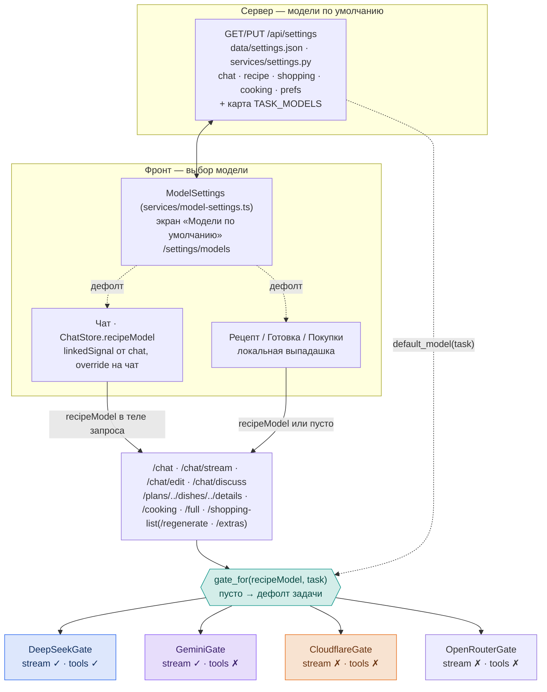
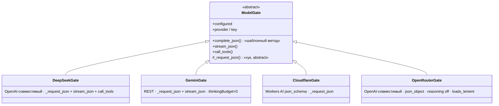
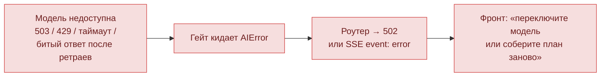
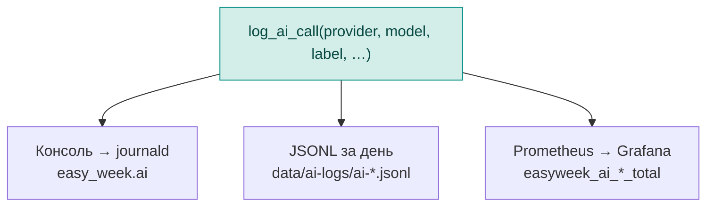

# Архитектура: выбор и роутинг AI-моделей

Как в Easy Week работает выбор модели для рецептов. Правила — в [`CLAUDE.md`](../CLAUDE.md),
код — в `backend/app/ai/`. Наглядная интерактивная версия этой схемы — артефакт (ссылку см. в задаче).

**Главное:** провайдеры спрятаны за общим интерфейсом `ModelGate`. Пользователь выбирает
модель для каждой задачи (дефолты — в общих настройках на сервере, страница может выбрать свою);
выбранная модель либо отвечает, либо честно падает с `AIError` — **тихого перехода на другую
модель нет (фолбэков нет)**.

Провайдеры (цвет = провайдер на схемах):
- 🔵 **DeepSeek** — `deepseek-chat`
- 🟣 **Gemini** — `gemini-flash-latest`
- 🟤 **Claude** — Anthropic API
- 🟠 **Cloudflare** — Workers AI (mistral / llama)
- ⚪ **OpenRouter** — OpenAI-совместимый шлюз, модель из `OPENROUTER_MODEL` (по умолчанию бесплатная
  `nvidia/nemotron-3-super-120b-a12b:free`) — проба дешёвых моделей на служебных задачах

**Карта задач.** Не всякая модель годится на всё: `TASK_MODELS` (`services/settings.py`) говорит,
какие модели можно выбрать для задачи (`chat` / `recipe` / `shopping` / `cooking` / `prefs`).
Дешёвые Cloudflare/OpenRouter — только план, покупки и предпочтения; рецепт и план готовки — DeepSeek /
Gemini / Claude. Карта едет фронту в `GET /api/settings` (`taskModels`) — выпадашки строятся по ней;
`PUT` с неподходящей парой → 422; `resolve_key` неподходящую явную модель заменяет дефолтом задачи
(warning в лог). Полная таблица — в [`CLAUDE.md`](../CLAUDE.md).

## 1. Выбор модели и роутинг

Два уровня: **дефолт задачи** (сервер, общий для семьи) и **локальный выбор страницы**
(чат — override на этот чат; рецепт/готовка — выпадашка вариантов; покупки — выпадашка для ↻).
Локальный выбор настройки **не** меняет. `recipeModel` едет в теле запроса (как `gender`);
пусто → бэк берёт дефолт задачи: `gate_for(model, task)` (`task` = chat | recipe | shopping | cooking |
prefs). Фоновое извлечение предпочтений (`ai/prefs.py`) — задача `prefs`, модель тоже из настроек.
Миграция: если на сервере настроек ещё нет (`initialized: false`), фронт разово переносит старый
`localStorage ew.recipeModel` на chat/recipe/cooking (покупки — Cloudflare).


```mermaid
flowchart TD
  subgraph SRV["Сервер — модели по умолчанию"]
    S["GET/PUT /api/settings<br/>data/settings.json · services/settings.py<br/>chat · recipe · shopping · cooking · prefs<br/>+ карта TASK_MODELS"]
  end
  subgraph FE["Фронт — выбор модели"]
    MS["ModelSettings (services/model-settings.ts)<br/>экран «Модели по умолчанию» /settings/models"]
    C["Чат · ChatStore.recipeModel<br/>linkedSignal от chat, override на чат"]
    PG["Рецепт / Готовка / Покупки<br/>локальная выпадашка"]
    MS -. "дефолт" .-> C
    MS -. "дефолт" .-> PG
  end
  S <--> MS
  C -- "recipeModel в теле запроса" --> API["/chat · /chat/stream · /chat/edit · /chat/discuss<br/>/plans/../dishes/../details · /cooking · /full · /shopping-list(/regenerate · /extras)"]
  PG -- "recipeModel или пусто" --> API
  API --> GF{{"gate_for(recipeModel, task)<br/>пусто → дефолт задачи"}}
  S -. "default_model(task)" .-> GF
  GF --> DS["DeepSeekGate<br/>stream ✓ · tools ✓"]
  GF --> GM["GeminiGate<br/>stream ✓ · tools ✗"]
  GF --> CF["CloudflareGate<br/>stream ✗ · tools ✗"]
  GF --> OR["OpenRouterGate<br/>stream ✗ · tools ✗"]

  classDef ds fill:#dde7fc,stroke:#2f6bed,color:#12305f;
  classDef gm fill:#e7ddfb,stroke:#8b5cf6,color:#3a1f6b;
  classDef cf fill:#f8e3d1,stroke:#e8701d,color:#6b3410;
  classDef sys fill:#d3ede9,stroke:#0d9488,color:#0a4a44;
  class DS ds; class GM gm; class CF cf; class GF sys;
```

## 2. Классы: `ModelGate` (Strategy + Template Method)

Общий пайплайн — в базе (`ai/base.py`), провайдер-специфика — в хуках подклассов.
Шаблонный метод `complete_json`: guard «настроен?» → ретрай транзиентных ошибок →
`log_ai_call` → `(parsed, usage)`. `stream_json`/`call_tools` — переопределяемые
(по умолчанию `NotImplementedError`).


```mermaid
classDiagram
  class ModelGate {
    <<abstract>>
    +complete_json()  «шаблонный метод»
    +stream_json()
    +call_tools()
    #_request_json()  «хук, abstract»
    +configured
    +provider / key
  }
  ModelGate <|-- DeepSeekGate
  ModelGate <|-- GeminiGate
  ModelGate <|-- CloudflareGate
  ModelGate <|-- OpenRouterGate
  class DeepSeekGate { OpenAI-совместимый · _request_json + stream_json + call_tools }
  class GeminiGate { REST · _request_json + stream_json · thinkingBudget=0 }
  class CloudflareGate { Workers AI json_schema · _request_json }
  class OpenRouterGate { OpenAI-совместимый · json_object · reasoning off · loads_lenient }
```

## 3. Что делает каждая модель по задачам

Каждую задачу делает её модель: выбранная на странице, иначе дефолт задачи из настроек
(колонка «Задача» → ключ `task`). Недостающие рецепты для покупок / PDF / плана готовки
догенерирует модель задачи `recipe`.

Колонка Cloudflare описывает и ⚪ OpenRouter там, где он допущен картой задач (план, покупки,
предпочтения): один JSON-запрос в JSON-режиме, форма ответа — в промпте, без стрима и tools.

| Задача | 🔵 DeepSeek | 🟣 Gemini | 🟠 Cloudflare |
|---|---|---|---|
| **План** (`chat`; блюда + короткие шаги) | один запрос — весь план | один запрос — весь план | **пайплайн:** меню (mistral) → спеки блюд (llama-8b, параллельно) → валидатор (mistral) |
| **Стриминг плана** | блюда по мере генерации (SSE) | блюда по мере генерации (SSE) | стрима нет: собирает целиком, отдаёт блюда теми же событиями |
| **Деталь рецепта** (`recipe`; ингредиенты + шаги) | один JSON-запрос: модель из выпадашки рецепта, первый вариант — дефолт `recipe` | ← | ← (json_schema, mistral) |
| **План готовки** (`cooking`) | один JSON-запрос: модель из выпадашки готовки, первый вариант — дефолт `cooking` | ← | ← (json_schema, mistral) |
| **Правки плана** (`chat`) | function calling (tools) | structured actions | structured actions |
| **Список покупок** (`shopping`, дефолт Cloudflare) | JSON-режим, форма ответа в `SHOP_SYSTEM` | ← | mistral + строгая json_schema `SHOP_SCHEMA` (Claude — как DeepSeek/Gemini: строгий JSON в промпте) |
| **Обсуждение** (`chat`; `/chat/discuss`: рецепт / готовка / покупки; применение — той же моделью чата, без неё — дефолт цели) | function calling (`DISCUSS_TOOLS`: update_recipe · replace_dish · regenerate) | structured JSON (`DISCUSS_SCHEMA`) | structured JSON (json_schema) |
| **↻ Перегенерировать** (рецепт / план готовки) | выбранная (открытая) модель, всегда новый вариант с учётом обсуждения | ← | ← |
| **↻ Перегенерировать** (покупки) | нормализация моделью из выпадашки страницы (дефолт `shopping`) мимо кэша, с учётом обсуждения | ← | ← |
| **Свои покупки** (`shopping`; `POST /shopping-list/extras`) | текст пользователя → позиции по отделам, JSON-режим, форма в `SHOP_EXTRAS_SYSTEM` | ← | mistral + `SHOP_SCHEMA` |

Метка провайдера сохраняется у плана (`provider`) и у детали блюда (`detail_provider`) — показывается бейджем.

## 4. Если модель падает — ошибка, а не подмена

Главное следствие отказа от фолбэков: сбой виден, решает его пользователь.


```mermaid
flowchart LR
  F["Модель недоступна<br/>503 / 429 / таймаут /<br/>битый ответ после ретраев"] --> E["Гейт кидает AIError"]
  E --> R["Роутер → 502<br/>или SSE event: error"]
  R --> U["Фронт: «переключите модель<br/>или соберите план заново»"]
  classDef err fill:#f6dede,stroke:#d24545,color:#6e1f1f;
  class F,E,R,U err;
```

## 5. Наблюдаемость: один лог — три стока

Каждый успешный вызов проходит через `log_ai_call` (внутри `complete_json`/стрима — логируется сам).


```mermaid
flowchart TD
  L["log_ai_call(provider, model, label, …)"] --> A["Консоль → journald<br/>easy_week.ai"]
  L --> B["JSONL за день<br/>data/ai-logs/ai-*.jsonl"]
  L --> C2["Prometheus → Grafana<br/>easyweek_ai_*_total"]
  classDef sys fill:#d3ede9,stroke:#0d9488,color:#0a4a44;
  class L sys;
```

## 6. Контекст промптов и разнообразие

System-промпты стабильны (общий префикс `COOK_PREAMBLE + FREEZE_RULES` кэшируется DeepSeek);
всё динамическое — в USER-сообщении.

- **Память беседы** (все генерации чата: новый план, правки, обсуждение): первое сообщение
  пользователя + последняя сводка беседы (`services/summary.py`: фоновая сводка моделью задачи
  `summary` через 5 с после реплик пользователя — дебаунс; одна на беседу, перезаписывается,
  на старте её нет). Блок собирает `prompt.chat_memory_block`, в USER-сообщение.
- **Новый план** (`/chat`, `/chat/stream`, CF-пайплайн): запрос + подсказка числа блюд + неделя/сезон
  (`_date_hint`) + «Недавно ели или отвергли — не повторяй и не делай близких вариаций» (≤30 названий,
  `services/history.variety_avoid`: 4 последних принятых плана, заменённые/удалённые за 30 дней по
  разнице версий `parent_id`, 👎 рецептам, до 5 блюд брошенных черновиков) + серверное зерно
  разнообразия `planner._variety_hint` (кухня-акцент, 1–2 способа, 2 основы с весом 1/(1+частота в
  истории), без нелюбимого; пишется в AI-лог полем `variety`) + пол ассистента + предпочтения
  (ограничения — жёстко; любимое — «в 1 блюде, явный запрос важнее»). Температура плана: 1.0
  (DeepSeek/Gemini); Claude/CF без температуры.
- **Замена/добавление одного блюда** (кнопки и tools/actions): отдельный промпт `SINGLE_DISH_SYSTEM`
  — пожелание, контекст беседы (исходный запрос + последние реплики), заменяемое блюдо с тегами,
  остальные блюда плана, «уже отвергнуто в этой беседе» (`history.conversation_rejected`), короткая
  история. В план всегда попадает ровно одно блюдо (`_pick_one`, лишние — warning в лог).
  `create_plan` сохраняет исходный запрос и историю. Предпочтения из действий по кнопкам не извлекаем.
- **Деталь рецепта**: шапка блюда из плана (теги, тайминги «уложись», гарнир), упоминание блюда в
  реплике плана, исходный запрос беседы (`plan.conversation_id`).
- **Обсуждение** (`/chat/discuss`, `routers/discuss.py`): `DISCUSS_SYSTEM` = общий префикс + правила
  («отвечай кратко в markdown, ничего не меняй без явной просьбы»). Первым user-сообщением — полный
  контекст цели (рецепт: шапка + ингредиенты/шаги/советы; готовка: шаги с таймингами; покупки:
  позиции) + другие блюда + исходный запрос; дальше — прошлые реплики этой цели мульти-тёрном
  (`services/discussion.discuss_turns`, ≤12 / ≤2500 симв., одинаковые роли склеены). Реплики пишутся
  в `MessageRow` с `discuss_target`/`dish_id`, версий плана не создают, предпочтения не извлекаем.
  Явная просьба → правка рецепта на месте (`variants[модель]`) / пересборка готовки или покупок;
  «замени блюдо» → `suggest_replace` (фронт переключает бейдж в режим замены).
- **Перегенерация** (`action=regenerate` у `/details` и `/cooking`, `POST /shopping-list/regenerate`,
  `services/regenerate.py`): в USER — обсуждение цели (`discussion_text`, фолбэк для рецепта —
  реплики с названием блюда) + выжимка текущего варианта + правило «есть пожелания — примени, нет —
  заметно другой вариант, суть сохрани». Запись в БД только после успеха (при ошибке старое цело).
- **Предпочтения** (`ai/prefs.py`, `data/preferences.json`, экран `/preferences`, `GET/PUT
  /api/preferences` — PUT частичный, валидация → 422): `allergies` / `dislikes` / `likes` /
  `suggested_allergies` / `macros {protein,fat,carbs: low|normal|high}` / `diet_note`. Старый файл
  (только likes/dislikes) читается с дефолтами; запись атомарная (tmp + `os.replace`) под локом.
  Экстрактор из чата (модель задачи `prefs`) раскладывает по уверенности: стопроцентное и
  постоянное — в likes/dislikes; «похоже на вкус» — в `suggested_dislikes`/`suggested_likes`
  (карточка «Это ваш вкус?»); разовое («на этой неделе без рыбы», «убери X») — никуда. Модель
  зовём только при словах про вкус; разовые маркеры и отзывы о блюде понижают до подсказки;
  «аллергия на X» — только в `suggested_allergies`: аллергии меняет лишь пользователь.
  `as_hint` → в USER: «АЛЛЕРГИИ — строго исключить, включая следы/соусы» (первыми) → ограничения
  (dislikes + неподтверждённые подсказки, жёстко) → любимое (мягко, только при подборе блюд) → БЖУ
  (только если не всё «норма») + заметка. Где: план, одно блюдо — всё; деталь/CF-спеки — без likes;
  план готовки — без likes и БЖУ; обсуждение рецепта/готовки — в контексте; покупки — нет.
  Зерно разнообразия исключает аллергены (`prefs.avoid_all`).
- **Claude**: где модель позволяет (Haiku 4.5 и старше) — prefill `{`; битый JSON → одна
  корректирующая попытка «верни только JSON», дальше без повторов того же входа
  (`AINonRetryable`); в лог — `stop_reason` и сырой сниппет.

## Файлы

```
backend/app/ai/
  base.py        # AIError/AINonRetryable + ModelGate (шаблонный метод + хуки)
  gates.py       # реестр GATES + gate_for(model, task) / resolve_key — пусто → дефолт задачи
  deepseek.py    # DeepSeekGate
  gemini.py      # GeminiGate
  anthropic.py   # AnthropicGate (prefill + корректирующая попытка JSON)
  cloudflare.py  # CloudflareGate
  openrouter.py  # OpenRouterGate (json_object + reasoning off, loads_lenient)
  tts.py         # озвучка шага: OpenRouter /audio/speech (Fish Audio, mp3), лог как у AI-вызовов
  planner.py     # роутинг по выбранной модели, без фолбэков; зерно разнообразия; одно блюдо
  prompt.py      # промпты (system стабильны, динамика — в user)
  observe.py     # log_ai_call (консоль + JSONL + Prometheus)
backend/app/services/
  settings.py    # модели по умолчанию по задачам + карта TASK_MODELS (data/settings.json)
  model_catalog.py # каталог конкретных моделей провайдеров, ссылки «провайдер[:id]»
  history.py     # «недавно ели или отвергли», отвергнутое в беседе, исходный запрос
  discussion.py  # реплики обсуждения цели: контекст перегенерации и мульти-тёрн
  regenerate.py  # (пере)генерация рецепта / плана готовки / покупок, бэкфилл деталей
  planstore.py   # ЕДИНСТВЕННАЯ запись planrow.dishes/cooking_plan: перечитать + CAS по версии
  recipestore.py # таблицы recipe/recipe_revision: двойная запись из planstore (SAVEPOINT),
                 #   закрепления блюд recipe_id/rev_ids, hydrate/book_entries (сверка, фаза 2)
  summary.py     # сводка беседы: дебаунс 5 с, одна на беседу; memory() — первое сообщение + сводка
  variants.py    # варианты рецепта по моделям (variants + active_model) + метаданные генерации
backend/app/migrations/  # CLI `python -m app.migrations` — только из deploy/update.sh / руками
  __main__.py    # status · rehearse · apply · verify · sync · strip · drop; защита живой базы
  recipes_v1.py  # шаг recipes_v1: перенос рецептов в таблицы, ссылки, сверка V1–V10
backend/app/routers/
  settings.py    # GET/PUT /api/settings
  discuss.py     # POST /api/chat/discuss
  tts.py         # GET /api/tts?text=… — mp3 с кэшем data/tts, single-flight по тексту
```
